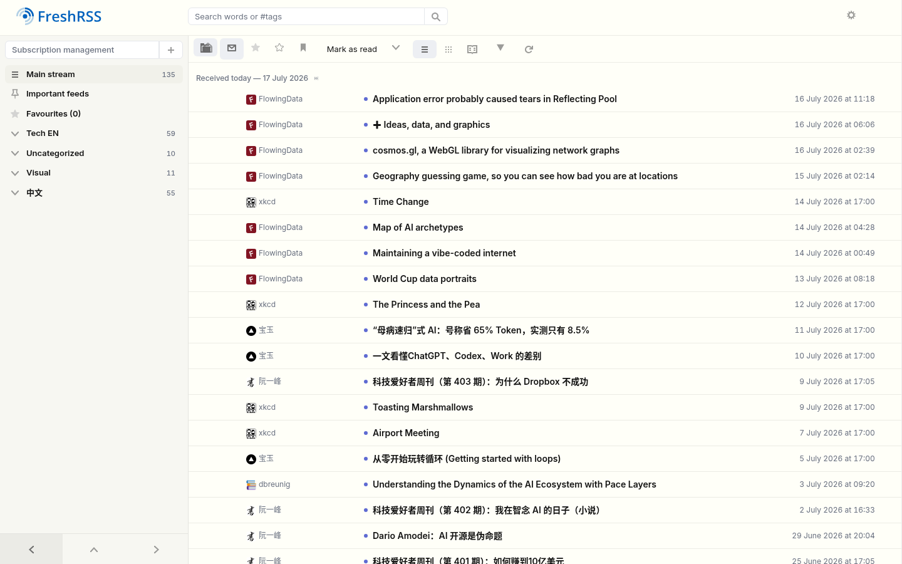
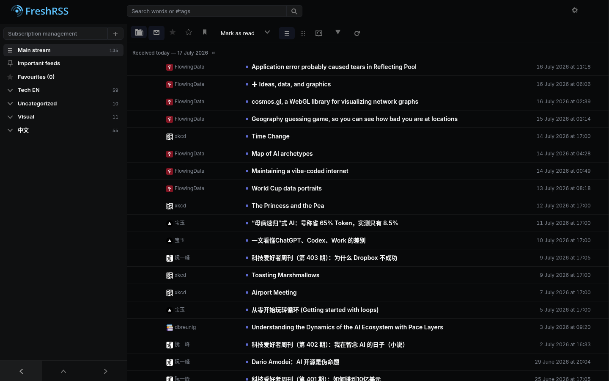
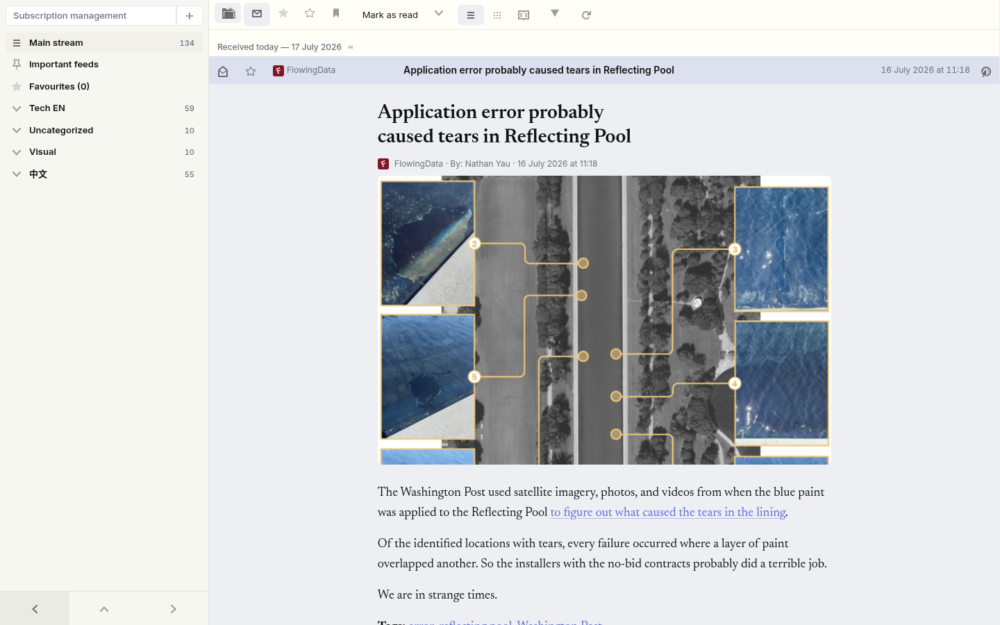

# Riverbed

A reading-first theme for [FreshRSS](https://github.com/FreshRSS/FreshRSS) 1.29+.
Tufte warm-white light mode, Linear-style near-black dark mode, Newsreader serif
for articles, Inter for chrome. Built for daily triage and long-form reading,
in English and Chinese, on desktop and phone.

| Light | Dark |
|---|---|
|  |  |



## What you get

- **Typography first.** Articles render in Newsreader (self-hosted, latin-only
  woff2 with `unicode-range`, so Chinese text uses your system serif with zero
  webfont delay) at 18px/1.6 on a measured column. The FreshRSS "content width"
  setting maps to real measures: thin 58ch, medium 66ch (the ideal), large 80ch.
- **Mixed Chinese/English.** Article prose uses native CSS `text-autospace`
  and `text-spacing-trim`, so a ~1/8em gap falls between 中文 and Latin/digits
  and fullwidth punctuation tightens up — a progressive enhancement that simply
  does nothing on browsers that don't support it yet. MathML renders natively;
  KaTeX/MathJax output keeps its own fonts.
- **Native light/dark.** Every color is declared once via CSS `light-dark()`;
  FreshRSS's own per-user setting (Settings → Display → Automatic dark mode)
  drives `color-scheme`. `auto` follows the OS, `no` forces light. No JS.
- **Quiet chrome.** 13px UI density, monochrome icons, unread counts as plain
  tabular numbers, unread articles marked by dot + weight (never color alone),
  row actions revealed on hover but always visible on touch.
- **Mobile.** Works with FreshRSS's drawer + bottom-pager model at ≤840px:
  44px touch targets, safe-area padding, sheet-style menus. Compatible with the
  TouchControl extension's swipe detection.
- **Accessible.** WCAG AA contrast on every token pair (verified in both
  schemes), visible focus rings everywhere, `prefers-reduced-motion` disables
  all transitions including core's drawer and slider.

## Install

A FreshRSS theme lives at `p/themes/Riverbed/` inside the FreshRSS web root. The
actual theme is the `Riverbed/` folder in this repo; `deploy.sh` copies it there
and bundles the CSS (see [Why bundle](#why-bundle-the-css)).

```sh
git clone https://github.com/wilbeibi/freshrss-riverbed.git
cd freshrss-riverbed
DEST=/path/to/FreshRSS/p/themes/Riverbed ./deploy.sh
```

Then pick **Riverbed** in Settings → Display → Theme.

**Docker / Podman.** The image's `p/themes/` is not persisted, so bind-mount a
host directory read-only and point `DEST` at it. In the compose/quadlet:

```
Volume=/host/freshrss/themes/Riverbed:/var/www/FreshRSS/p/themes/Riverbed:ro
```

Restart the container once, then `DEST=/host/freshrss/themes/Riverbed ./deploy.sh`.
CSS updates afterwards need no restart.

**No shell?** Copy the `Riverbed/` folder into `p/themes/` directly. It works,
but skips bundling — after a theme *update* you may need to hard-refresh once to
clear the browser cache (see below).

### Why bundle the CSS

The theme's source is split into `_*.css` partials that `Riverbed/riverbed.css`
`@import`s. `deploy.sh` inlines them into a single served `riverbed.css`.
FreshRSS's Apache serves theme assets with a 30-day `Cache-Control` and only
cache-busts the metadata-listed file by mtime, so runtime `@import` partials
would go stale for up to a month after an update. Bundling makes every update
land immediately.

## Recommended FreshRSS settings

- Automatic dark mode: **Auto**
- Content width: **Medium** (66ch; "Thin" ≈ 39 CJK chars/line if you read mostly Chinese)
- Website: **Icon and name**

## Limitations

- FreshRSS's dark-mode setting has two states (`no` / `auto`); there is no
  "always dark while the OS is light". Set your OS/browser to dark instead.
- Login/registration pages render with the **default user's** theme, so they
  only show Riverbed once the default user selects it.
- FreshRSS core updates can change selectors. The theme fails soft — anything
  unstyled falls back to core's structure, never a broken page — but a major
  update may need a visual pass (see [DESIGN.md](DESIGN.md) for the surfaces
  Riverbed styles).

## Licensing

Theme CSS: MIT. Bundled fonts: Inter (© The Inter Project Authors) and
Newsreader (© The Newsreader Project Authors), both SIL OFL 1.1 — see
`Riverbed/fonts/OFL.txt`.
